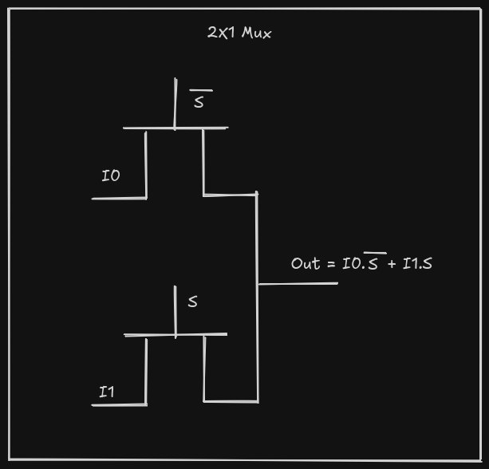
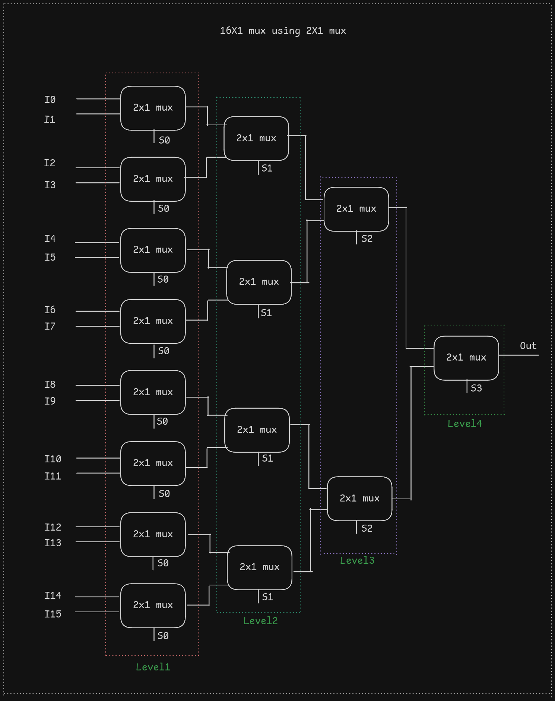

<body>

<h1>16×1 Multiplexer using Pass Transistor Logic (PTL)</h1>

This project implements a <strong>16-to-1 multiplexer</strong> using a
<strong>hierarchical Pass Transistor Logic (PTL)</strong> approach.
The design starts from a transistor-level 2×1 multiplexer and scales hierarchically
to realize a complete 16×1 multiplexer.

<h2>1. Why Pass Transistor Logic (PTL)?</h2>

Pass Transistor Logic (PTL) implements logic functions by directly passing signals
through transistors rather than evaluating them using static logic gates.
This approach is particularly efficient for multiplexers.

<h3>Advantages of PTL</h3>
<ul>
    <li>Reduced transistor count compared to static CMOS</li>
    <li>Lower switching capacitance</li>
    <li>Faster signal propagation</li>
    <li>Clear transistor-level interpretation</li>
    <li>Ideal for CMOS and VLSI education</li>
</ul>

This project intentionally uses PTL to match the CMOS-level diagrams and to provide
a closer representation of transistor-level behavior.

<h2>2. PTL-Based 2×1 Multiplexer Design</h2>

The fundamental building block of this project is a <strong>2×1 multiplexer</strong>
implemented using pass transistor logic. The logical function is:

<pre>
Out = (I0 · S̅) + (I1 · S)
</pre>

When the select signal <code>S = 0</code>, input <code>I0</code> is passed to the output.
When <code>S = 1</code>, input <code>I1</code> is passed to the output.

Figure 1: Pass Transistor Logic (PTL) implementation of a 2×1 multiplexer

The select signal and its complement control two pass transistors, ensuring that only
one input drives the output at any time.

<h2>3. Hierarchical Construction of 16×1 Multiplexer</h2>

The complete 16×1 multiplexer is constructed hierarchically using multiple instances
of the PTL-based 2×1 multiplexer.

<ul>
    <li>Level 1: 8 × 2×1 multiplexers (controlled by S0)</li>
    <li>Level 2: 4 × 2×1 multiplexers (controlled by S1)</li>
    <li>Level 3: 2 × 2×1 multiplexers (controlled by S2)</li>
    <li>Level 4: 1 × 2×1 multiplexer (controlled by S3)</li>
</ul>

Figure 2: Hierarchical construction of a 16×1 multiplexer using 2×1 PTL blocks

This modular approach simplifies design, verification, and understanding while
closely matching the Verilog hierarchy.

<h2>4. Verilog Implementation</h2>

The Verilog implementation uses switch-level primitives to accurately model
pass transistor behavior:

<ul>
    <li><code>tranif0</code> – Passes signal when control is logic 0</li>
    <li><code>tranif1</code> – Passes signal when control is logic 1</li>
</ul>

This ensures a direct correspondence between the CMOS diagrams and the Verilog code.

<h2>5. Running the Project on Linux</h2>

<h3>Required Tools</h3>
<ul>
    <li>Icarus Verilog</li>
    <li>GTKWave</li>
</ul>

<h3>Installation (Ubuntu / Debian)</h3>
<pre>
sudo apt update
sudo apt install iverilog gtkwave
</pre>

<h3>Compilation</h3>
<pre>
iverilog -o mux_sim mux2to1.v mux4to1.v mux16to1.v muxtest.v
</pre>

<h3>Simulation</h3>
<pre>
vvp mux_sim
</pre>

<h3>Waveform Viewing</h3>
<pre>
gtkwave mux16to1.vcd
</pre>

<h2>6. Conclusion</h2>

This project provides a clear and consistent demonstration of a 16×1 multiplexer
implemented using Pass Transistor Logic. By aligning Verilog code, CMOS diagrams,
and hierarchical design, the project offers strong educational value in transistor-
level digital design.

</body>
</html>
